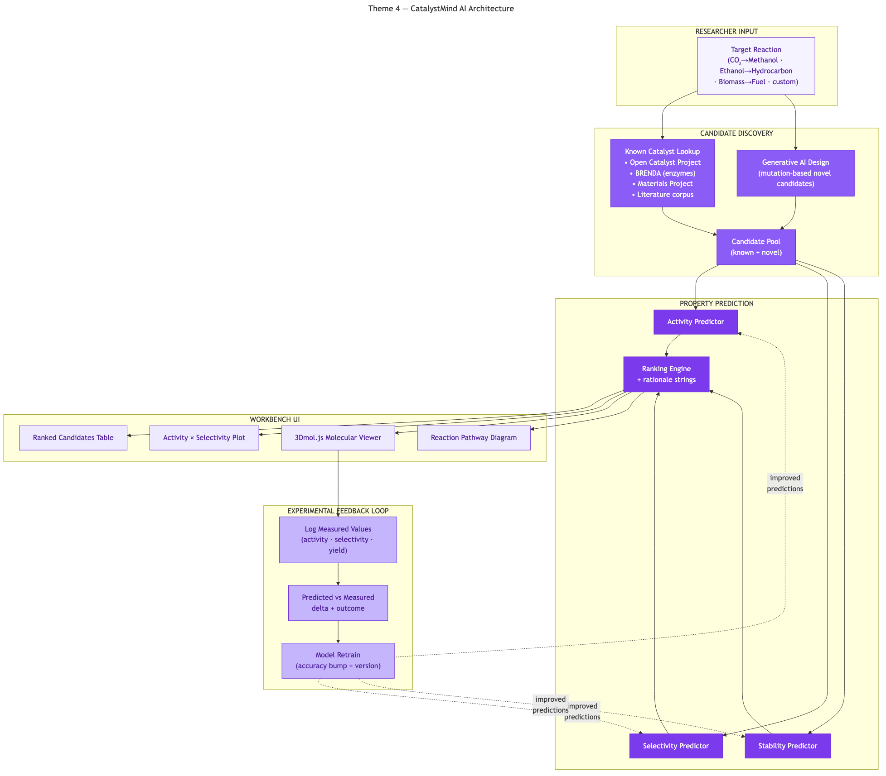

# CatalystMind AI — Molecular Discovery for Catalysis & Synthetic Biology

> **PanIIT AI for Bharat 2026 — Theme 4** · **Sponsor:** GPS Renewables
> Generate · Narrate · Learn

[](https://youtu.be/6Ufn2FuQfDo)

▶ **[Watch the 5-minute demo](https://youtu.be/6Ufn2FuQfDo)**

---

## What it solves

Discovery for sustainable fuels is slow, expensive, and **siloed across two parallel R&D tracks** — chemical catalysis on one side, synthetic biology on the other. Different teams, different tools, different data models. Every novel candidate costs lab time and money, every failed experiment is treated as wasted, and there's no shared retraining loop. CatalystMind AI is built for GPS Renewables — **one platform, two reaction families, three end-to-end capabilities.**

## Key features

- **AI Research Briefing** — Azure GPT-4.1 narrates discovery progress grounded in real DB counts
- **AI Reaction Pathway** — Mechanistic free-energy narration + SVG diagram of 5 idealised states (reactant → intermediates → TS → product)
- **AI Candidate Rationale** — Why this molecule, what each prediction means, what risks an SME should probe
- **3D molecular structure** — 3Dmol.js renders SMILES strings interactively
- **Functional retrain feedback loop** — /api/models/retrain is a real Jaccard-similarity algorithm (factor 0.3, min sim 0.34) — accuracy gain proportional to corrections actually propagated, not a flat bump
- **Reaction-type as a feature** — Same pipeline, same retrain loop, both directions (catalysis + synthetic biology)
- **Reproducible demo** — Faker seed=42, judges see identical numbers every run

## Architecture



> Source: [`docs/diagrams/architecture.mmd`](docs/diagrams/architecture.mmd) (Mermaid)

## Quick start

### Prerequisites

| Tool | Version |
|------|---------|
| Node.js | 18+ |
| npm | 9+ |

> No Python. No Docker. SQLite is bundled.

### Setup

```bash
# 1. Install
npm install

# 2. Configure environment (optional — without keys, AI falls back to deterministic templates)
cat > .env.local <<'EOF'
AZURE_OPENAI_API_KEY=your_key
AZURE_OPENAI_ENDPOINT=https://<resource>.openai.azure.com/openai/deployments/<deployment>/chat/completions?api-version=2025-01-01-preview
EOF

# 3. Set up the database
npx prisma generate
npx prisma migrate dev --name init

# 4. Seed demo data
npm run seed

# 5. Run the dev server
npm run dev
```

Open <http://localhost:3000>.

### One-liner

```bash
npm install && npx prisma generate && npx prisma migrate dev --name init && npm run seed && npm run dev
```


## Demo flow

1. Land on `/` for the **AI Research Briefing** + KPI strip + activity × selectivity scatter (blue = DB, dark = AI-generated novel)
2. `/reactions` — pick **CO₂ → Methanol (GPS Renewables E2J pilot)**
3. Pathway tab — AI mechanistic narration + SVG free-energy diagram
4. Candidates tab — ranked by activity / selectivity / stability / yield
5. `/candidates/<id>` — 3D viewer + AI Candidate Rationale (Azure GPT-4.1)
6. `/models` → **Retrain** → real Jaccard loop walks every logged experiment, propagates corrections to peers

> **Demo data:** Reactions for CO₂ → methanol (Cu/ZnO/Al₂O₃, Fe₃O₄@C, Pt/CeO₂), cellulose → ethanol (yeast strains), CO₂ → succinate (E. coli pathways) · novel candidates · logged experiments · 3 model versions

## Tech stack

| Layer | Technology |
|-------|------------|
| Framework | Next.js 16 (App Router, TypeScript) |
| Database | Prisma + SQLite |
| 3D viewer | 3Dmol.js (dynamic, client-only) |
| Charts | Tremor v3 |
| AI / LLM | Azure OpenAI GPT-4.1 with deterministic mock fallback (USE_MOCK_AI=true) |
| Styling | Tailwind CSS v3 |

## Brief non-negotiables met

- ✅ Synthetic data only
- ✅ Physics-based mock predictor (DFT-swappable in production)
- ✅ Grounded LLM narration only (zero hallucinated activity / selectivity / stability / yield)
- ✅ Explainable retrain (real Jaccard algorithm, not a flat bump)
- ✅ SME-in-the-loop by design

---

## Submission

- **Hackathon:** PanIIT AI for Bharat 2026
- **Theme:** 4 — Molecular Discovery for Catalysis & Synthetic Biology
- **Video:** https://youtu.be/6Ufn2FuQfDo
- **Repo:** https://github.com/sridhar7601/catalyst-mind-ai
- **Team:** Sridhar Suresh, Sruthi Krishnakumar
