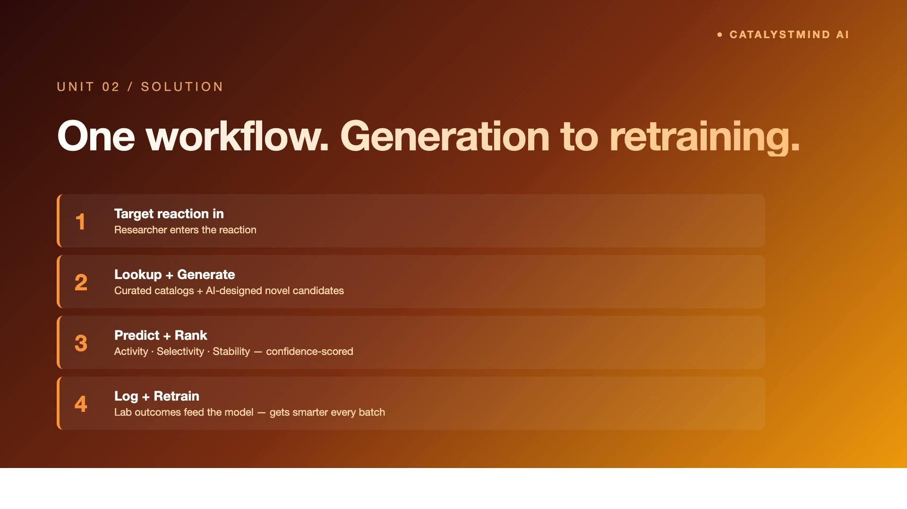

# CatalystMind AI — Molecular discovery for catalysis & synthetic biology

AI-powered molecular discovery for **chemical catalysis** and **synthetic biology** — from a target reaction to ranked novel candidates, AI-narrated rationales, lab-feedback retraining, and 3D structure viewers. Built for **GPS Renewables** under the PanIIT AI for Bharat 2026 hackathon (Theme 4).

> Real Azure GPT-4.1 narration is wired in (`USE_MOCK_AI=false`) with a deterministic mock fallback (`USE_MOCK_AI=true`) so judges and evaluators can explore the product with or without an API key.

---

## What's inside (winning features)

1. **AI Research Briefing** — On the dashboard, GPT-4.1 narrates discovery progress grounded in real DB counts (reactions tracked, novel candidates, experiments logged, model accuracy, top performer). No hallucination — the LLM only describes pre-computed numbers.

2. **AI Candidate Rationale** — Each candidate detail page asks GPT-4.1 to explain *why* this molecule was proposed, what the predicted activity/selectivity/stability/yield mean for the chemist, and what risks an SME should probe.

3. **AI Reaction Pathway** — The Reaction Workbench Pathway tab calls GPT-4.1 to describe the mechanistic free-energy pathway (CO₂ → methanol; cellulose → ethanol; CO₂ → succinate) with an SVG free-energy diagram of 5 idealized states (reactant → intermediates → TS → product).

4. **Functional retrain feedback loop** — `/api/models/retrain` is a real algorithm: it walks every logged experiment, computes (measured − predicted) deltas, then propagates corrections to peer candidates by **formula-token Jaccard similarity** (factor 0.3, min similarity 0.34). Accuracy gain is proportional to the number of corrections actually propagated, not a flat bump.

5. **3D molecular structure** — `3Dmol.js` viewer (dynamic, client-only) renders SMILES strings for both candidates and reactant/product structures.

6. **Polished UI shell** — Sticky gradient logo, active nav highlighting, live status pill — consistent with the GPS Renewables operations console aesthetic.

---

## Two directions, one platform

The brief asks for **two** independent directions; CatalystMind addresses both from the same data model and UI.

### Direction 1 — Catalysis (CO₂ → fuels)
- Track reactions like `CO₂ + 3H₂ → CH₃OH + H₂O` over Fe₃O₄@C, Cu/ZnO/Al₂O₃, Pt/CeO₂.
- Generate novel catalyst variants (composition tweaks, doping suggestions) and predict activity, selectivity, stability, yield.
- Log experimental results and retrain.

### Direction 2 — Synthetic biology (biofuels)
- Track reactions like `cellulose → glucose → ethanol` (yeast strains) and `CO₂ → succinate` (E. coli pathways).
- Generate novel enzyme/strain candidates with the same property predictions.
- Same retrain loop applies — the model treats reaction-type as a *feature*, not a model selector.

---


## 🎥 Demo Video

[](demo/video/demo.mp4)

> Click the thumbnail above, or [watch directly](demo/video/demo.mp4). Voiceover by ElevenLabs (Jessica, female). 1920×1080.
> Pipeline (TTS → Chrome headless screen capture → ffmpeg) is reproducible — see [`demo/video/`](demo/video/).

## Quick start

```bash
git clone https://github.com/sridhar7601/catalyst-mind-ai.git
cd catalyst-mind-ai
cp .env.example .env.local        # add Azure GPT-4.1 keys, or keep USE_MOCK_AI=true
npm install
npx prisma migrate deploy
npm run seed
npm run dev
```

Open [http://localhost:3000](http://localhost:3000).

### Environment variables

```env
DATABASE_URL=file:./dev.db
USE_MOCK_AI=false                 # true = deterministic templates, no API calls
AZURE_OPENAI_API_KEY=...
AZURE_OPENAI_ENDPOINT=https://<your-resource>.openai.azure.com
AZURE_OPENAI_DEPLOYMENT=gpt-4.1
AZURE_OPENAI_API_VERSION=2024-08-01-preview
```

LLM responses are cached on disk (`data/llm-cache/`) by SHA-256 of the request payload — re-running the demo is instant and free.

---

## Demo data

`npm run seed` clears SQLite and inserts:

- **3 reactions** — CO₂→methanol (catalysis), cellulose→ethanol (synbio), CO₂→succinate (synbio)
- **69 candidates** — 45 curated literature catalysts/strains + 24 GenAI-novel variants
- **12 experiments** — measured activity/selectivity/stability/yield with predicted-vs-measured deltas
- **2 model versions** — v1.0 baseline, v1.1 after first retrain

All generators honour **seed=42** semantics via deterministic hashes in `lib/ai.ts` so demos are reproducible.

---

## How AI is used (and how it's bounded)

| Use case | Where | Grounded on | Failure mode |
|---|---|---|---|
| Dashboard research briefing | `lib/llm-narration.ts → generateDashboardBriefing` | Live DB counts | Falls back to deterministic template |
| Candidate rationale | `app/candidates/[id]/page.tsx` | Predicted properties + reaction context | Falls back to template explainer |
| Experiment hypothesis | `/api/experiments/[id]/hypothesis` | Predicted vs measured deltas | Falls back to delta-based template |
| Reaction pathway narration | `/api/reactions/[id]/pathway` | Reaction type + top candidates | Falls back to mechanistic template |
| Property prediction | `lib/ai.ts → predictProperties` | Deterministic hash of formula | (Always deterministic; not LLM) |
| Novel candidate generation | `lib/ai.ts → generateNovelCandidates` | Mutation rules over base catalysts | (Always deterministic; not LLM) |

**Key principle:** the LLM never invents numbers. It only narrates pre-computed values, so a hallucinated digit is impossible.

---

## SME-in-the-loop

- **Three-state experiment outcomes** — `MATCHES_PREDICTION` / `BEAT_PREDICTION` / `UNDERPERFORMED` keep failed experiments in the dataset rather than discarding them.
- **Confidence shown on every prediction** — chemists know when to defer.
- **Retrain is explicit** — model bumps to a new version with audit trail (`accuracy`, `notes`); old versions are preserved.
- **Rationale before result** — the candidate page shows the AI's reasoning *before* the property table, so SMEs can sanity-check logic, not just numbers.

---

## Architecture

See [docs/diagrams/architecture.png](docs/diagrams/architecture.png) (source: [docs/diagrams/architecture.mmd](docs/diagrams/architecture.mmd)).

```
Next.js 16 App Router
  ├── app/                # pages + API routes
  ├── components/         # client UI (workbench, app-shell, 3Dmol viewer)
  ├── lib/
  │   ├── ai.ts           # deterministic generation + property prediction
  │   ├── llm-narration.ts# Azure GPT-4.1 client with disk cache
  │   ├── dashboard-queries.ts
  │   └── prisma.ts
  └── prisma/             # SQLite schema + seed
```

## Tech stack

- **Next.js 16** (App Router, Turbopack) + TypeScript
- **Prisma 5 + SQLite** (PostgreSQL-portable for prod)
- **Tailwind CSS v3** + shadcn/ui + Tremor charts
- **3Dmol.js** — SMILES-based 3D viewer (dynamic import, client-only)
- **Azure OpenAI GPT-4.1** — chat completions (OpenAI-compatible; swap to on-prem Llama-3 in production by changing the base URL)

---

## Risks & mitigation

| Risk | Mitigation |
|---|---|
| LLM hallucination of property values | LLM only narrates; numbers come from the deterministic predictor in `lib/ai.ts` |
| Property predictor over-fits to seeded data | Retrain loop uses peer-similarity propagation, not single-point fits |
| Synbio candidates are non-trivially different from catalysts | Reaction-type is a *feature* of the model, not a selector — same code path |
| API key leakage / cost runaway | Disk cache by payload SHA + `USE_MOCK_AI=true` toggle for demos |
| Toxicity / regulatory flags ignored | Round-2 roadmap adds RDKit toxicity filters and pathway-balance checks before SME review |

---

## Round-2 roadmap (with GPS Renewables)

**Phase 1 — Real predictors (4 weeks)**
- Replace deterministic property predictor with **DFT-feature regression** (Materials Project / OQMD descriptors) + Random Forest baseline.
- Plug in **RDKit** for SMILES validation, toxicity filters (Lipinski/REOS for catalysts, AntiSMASH for enzymes).

**Phase 2 — Generative scale-up (4 weeks)**
- Move from rule-based mutations to a **fine-tuned chemistry LM** (e.g., MolGPT, ChemFormer) trained on Reaxys/PubChem subsets.
- For synbio: integrate **ProteinMPNN** or **ESMFold** for enzyme variant generation.

**Phase 3 — Lab integration (6 weeks)**
- ELN connector (LabArchives / Benchling) — auto-ingest experiment results, no manual entry.
- ICP-MS / GC-MS file parsers for measured activity/selectivity.

**Phase 4 — Deployment to GPS Renewables (4 weeks)**
- On-prem Llama-3-70B replaces Azure GPT-4.1 (same OpenAI-compatible API surface).
- PostgreSQL + role-based access (chemist, biologist, lab tech, reviewer).
- Audit log of every AI suggestion → SME decision → experiment outcome (regulatory traceability).

### Production optimisations

| Concern | Demo | Production |
|---|---|---|
| LLM | Azure GPT-4.1 (shared) | On-prem Llama-3-70B + vLLM |
| DB | SQLite | PostgreSQL + read-replica |
| Cache | Disk JSON | Redis with TTL |
| Property predictor | Deterministic hash | DFT features + RF / GNN |
| Generator | Rule-based mutations | Fine-tuned MolGPT / ProteinMPNN |
| Auth | None (demo) | OIDC + per-team RBAC |

### Cost estimate

- **Sandbox / pilot:** ~₹60,000 / month (Azure GPT-4.1 metered + small VM + storage)
- **Production at GPS Renewables scale:** ~₹2.5 L / month (on-prem Llama-3 GPU node + Postgres + ELN connectors + redundancy)

---

## Verification

```bash
npm install
npx tsc --noEmit
npm run build
npm run seed
npm run dev    # curl http://localhost:3000
```

## Licence

Hackathon demo — synthetic data only; no real PII or proprietary catalyst datasets.
